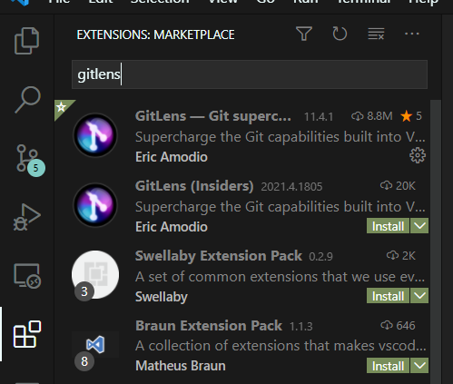
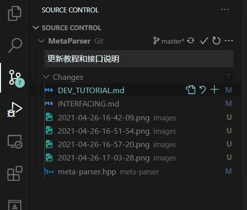

# 开发者帮助

## 环境

**git和vscode**

安装git和vscode，安装时记得勾选以下选项或类似选项（如果有）

- 将"git bash here"加入右键菜单（context menu）
- 将git加入PATH环境变量。
- 将"用Code打开"加入右键菜单（context menu） 

其他选项默认即可。


**CMake**

安装时**务必勾选以下内容**


 
**Visual Studio**

有C++模块即可

**VSCode插件：CMake Tools**


 
## 打开项目

安装完后选择一个文件夹，右键git bash here。

输入

```
git clone https://gitee.com/Binary-Song/MetaParser.git
```

会出现一个文件夹MetaParser，右键该文件夹，选择“通过VSCode打开”


 
## 配置和编译

先配置项目才可以编译。

ctrl+shift+P 输入quick start，选择编译器


选择 amd64

点击按钮配置


点击模块右边的按钮编译。


右键,run in terminal，运行（不debug）。


运行结果在下方


## 项目结构

每个模块都有自己的文件夹，文件夹名即是模块名，开发者只需编辑自己的文件夹即可。

如果需要增加头文件（.hpp），直接在模块文件夹中增加。如果需要增加源文件（.cpp），修改在模块文件夹中的CMakeList.txt的第一行:

```
add_library(模块名 源文件1 源文件2 ...)
```

如果需要增加依赖的模块，修改CMakeList.txt的第三行

```
target_link_libraries(模块名 PUBLIC 引用的模块1 引用的模块2 ... )
```

之后就可以在自己的模块中写：

```
#include <引用的模块中的头文件>
```

来引用其他模块了。

测试文件写在 模块名-test.cpp中。不要将main函数写在除此之外的其它地方。

## 调试测试的方法

方法1：

右键测试对象，Debug


缺点：无法输入

方法2：

1. 切换到 VC++ CMake debug


2. 设置为Launch Target


3. 按F5即可弹出黑窗口，可输入可输出

## 代码管理

本项目用git进行代码管理。建议安装插件GitLens。



当你进行了一些更改后，可以按提交到**本地**仓库。提交时要写你更改了什么。。

同步按钮可以将本地仓库和远程仓库同步。当你积攒了几次提交后，可以按此按钮与远程同步。

同步时可能会出现和远程仓库冲突。例如，你和别人同时修改了同一个文件的同一行，提交后就会有冲突。尽量只修改自己的模块，不要随便改动别人的代码可以很好地避免冲突。建议如果发生冲突不确定如何解决时，将问题发到群里商讨解决。

以上内容基本够用，更多关于git的内容请参考网上的教程，这里不再赘述。