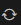

# 目前的任务

语法分析器的实现分为2步走：

1. 实现配置过程
2. 实现分析过程

配置过程是项目的难点。在这个过程中，Parser得到一个产生式集合（`std::vector<ParserRule>`），它需要判定该产生式集是否为LL(1)文法，同时计算出预测分析表。

这个过程分为5步：

1. 计算能推导出空的非终结符
2. 计算first集
3. 计算follow集
4. 计算select集
5. 产生预测分析表

分析过程即是利用预测分析表对源代码进行语法分析。这个比较简单。

# 语法分析器模块定义

我们首先将实现配置过程的前4步，每个步骤对应一个函数（详见meta-parser.hpp），由1人完成。

1. _compute_empty_deriving_symbols();
2. _compute_first_set();
3. _compute_follow_set();
4. _compute_select_set();

这4个函数分别定义在empderv/empderv.cpp, first/first.cpp, follow/follow.cpp 和 select/select.cpp中，实现它们即可。

它们都是Parser类的成员函数，因此共享Parser类的成员变量。在实现时，需要引用彼此的计算结果。因此为了方便，以上4个函数的结果都是直接写入Parser成员变量，而不是返回结果。4个函数的结果变量为：

1. std::vector<std::int8_t> empty_derivings;
2. std::vector<std::set<symbol_id>> first_set;
3. std::vector<std::set<symbol_id>> follow_set;
4. std::vector<std::set<symbol_id>> select_set;

# 测试

empderv/empderv-test.cpp, first/first-test.cpp, follow/follow-test.cpp 和 select/select-test.cpp，是用来写测试的。main函数请写在这些文件内，不要写在其他文件中。测试用的数据请自己编制，例如求follow_set集合如果需要first_set，就手动将正确的first_set填充后再运行_compute_follow_set。

测试中可以使用input-resolver.hpp中提供的InputFileResolver类，来进行产生式的读取（直接`#include<input-resolver.hpp>`即可）。输入文件的格式和该类的用法参见examples文件夹中给出的详细示例。此外，我还提供了词法分析器，但目前的配置阶段可能用不上。examples文件夹中也给出了词法分析器的使用示例。

测试的运行和调试方法已经在DEV_TUTORIAL.md中给出。如果还有不明白的，可以参看文章 https://www.bilibili.com/read/cv7205843

# 防止git冲突的办法

DEV_TUTORIAL.md已经更新vscode中git的使用方法。

为了避免git冲突，建议：

* 只修改自己的模块。如我负责first集合，那就只修改meta-parser/first文件夹中的内容。

* 及时和服务器同步（推荐安装gitlens vscode插件）,同步是这个按钮：

如果发生冲突，建议将冲突发在群里讨论解决。

# 解决问题

如果开发过程中有任何问题，都可以发在群里或者联系我解决。