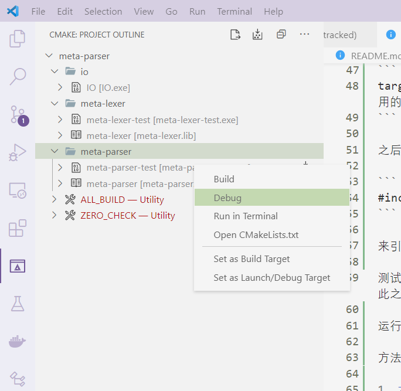
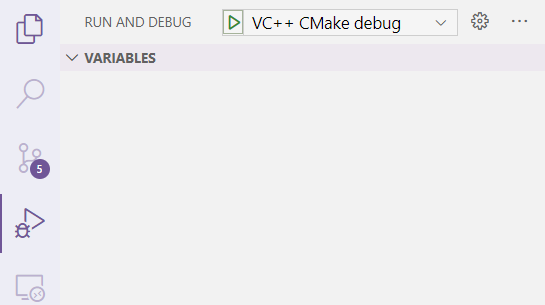

# 编译编译器

一款用来编译编译器的编译器。

## 特性

- 输入正则表达式，生成词法分析器

- 输入产生式，生成LL(1)语法分析器

- 显示预测表

## 模块说明

### shared

共享模块，别的模块都可以依赖它。

### io

输入文件，输出词法规则和语法规则

### meta-lexer

输入词法规则，生成词法分析器

### meta-parser

输入语法规则，生成语法分析器

### driver

使用生成的词法和语法分析器，编译文件，返回其是否该语言的句子。

## 提示

每个模块都有自己的文件夹，文件夹名即是模块名，开发者只需编辑自己的文件夹即可。

如果需要增加头文件（.hpp），直接在模块文件夹中增加。如果需要增加源文件（.cpp），修改在模块文件夹中的CMakeList.txt的第一行:

```
add_library(模块名 源文件1 源文件2 ...)
```

如果需要增加依赖的模块，修改CMakeList.txt的第三行

```
target_link_libraries(模块名 PUBLIC 引用的模块1 引用的模块2 ... )
```

之后就可以在自己的模块中写：

```
#include <引用的模块中的头文件>
```

来引用其他模块了。

测试文件写在 模块名-test.cpp中。不要将main函数写在除此之外的其它地方。

运行测试的方法

方法1：

右键测试对象，Debug



缺点：无法输入

方法2：

1. 切换到 VC++ CMake debug




2. 设置为